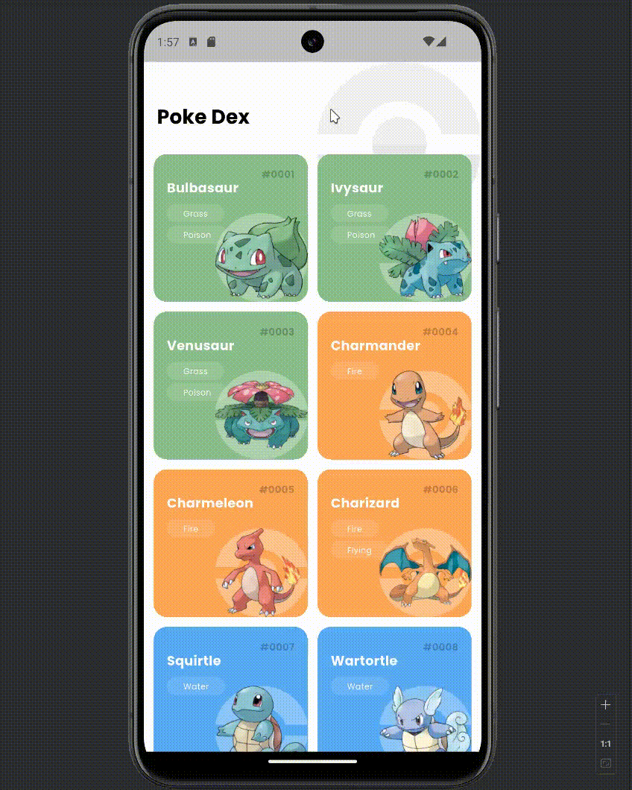
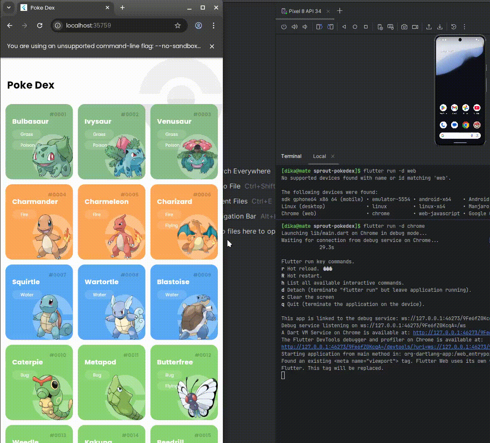
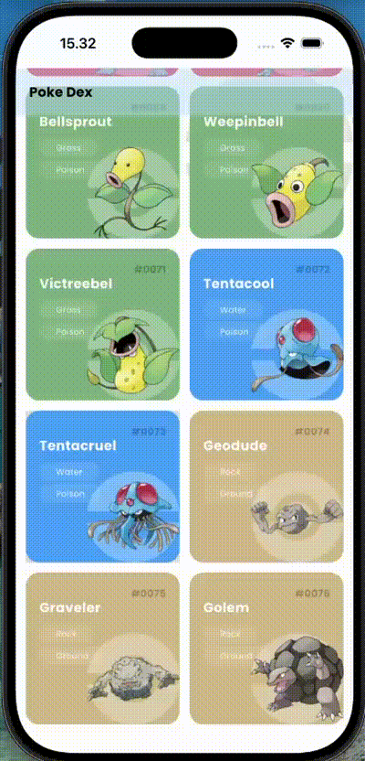

# sprout_pokedex

Pokémon Gallery - Immersive Flutter application showcasing endless Pokémon collection with seamless scrolling, high-quality  sprites, and detailed information sourced directly from PokeAPI (https://pokeapi.co/)

## Project setup

1. Download dependencies by running command

   ```bash
   $ flutter pub get
   ```

2. Select device that you want to test, to know available device you can execute command

   ```bash
   $ flutter devices
   ```

   The command result should be like this 

   ```bash
   $ flutter devices
   Found 2 connected devices:
    sdk gphone64 x86 64 (mobile) • emulator-5554 • android-x64    • Android 14 (API 34) (emulator)
    Linux (desktop)              • linux         • linux-x64      • Manjaro Linux 6.12.48-1-MANJARO
    Chrome (web)                 • chrome        • web-javascript • Google Chrome 142.0.7444.59
   ```

3. Select device by execute command 
    ```bash
   $ flutter run -d <device_name>
   ```
   As sample from the out list device above then the command should be like this 
    ```bash
   $ flutter run -d linux
    ```
   

## Project show case

| Platforms         |                                                              |
| ----------------- | ------------------------------------------------------------ |
| **Android**       |  |
| **Web**           |  |
| **Linux Desktop** |  |
| **Ios Portrait**  |  |
| **Ios Landscape** |  |
| **Mac OS**        |  |


## Melos Configuration
---------
### 1. Install Melos globally
```bash
$ dart pub global activate melos
```
### 2. Bootstrap the project (creates dependency overrides)
```bash
$ melos bootstrap
```

### 3. Verify packages are detected
```bash
$ melos list
```

Should output:
- core (packages/core)
- sprout_pokedex (.)


### 4. Run initial code generation
```bash
$ melos run generate
```

### 5. Verify everything works
```bash
$ melos run analyze
$ melos run test
```
